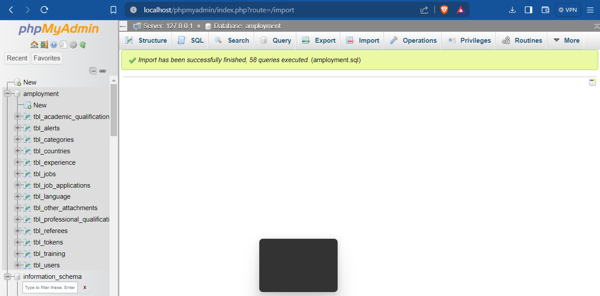
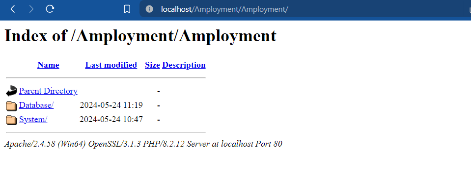
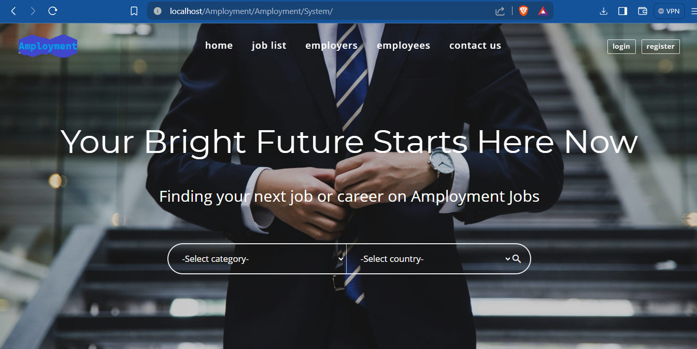

# AMPLOYMENT---for-Employers-and-Employees-
This is Job portal Software using HTML, CSS, JS, PHP and MYSQL. Developed During Hackathon By 3 Members Team.
Some Image Shots:

<br>

<br>

<br>

<br>
Sure! Here are the steps to run a PHP MySQL project:

### Prerequisites
1. **Install a local server environment:** You can use software like XAMPP, WAMP, MAMP, or LAMP depending on your operating system.
2. **Install a text editor or IDE:** Software like Visual Studio Code, Sublime Text, or PHPStorm can be used to edit your PHP files.

### Steps to Run a PHP MySQL Project

1. **Download and Install Local Server Environment:**
   - **XAMPP:** Go to the [XAMPP website](https://www.apachefriends.org/index.html) and download the installer for your operating system. Follow the installation instructions.
   - **WAMP:** Go to the [WAMP website](http://www.wampserver.com/en/) and download the installer. Follow the installation instructions.
   - **MAMP:** Go to the [MAMP website](https://www.mamp.info/en/) and download the installer for macOS. Follow the installation instructions.
   - **LAMP:** Follow the instructions for setting up a LAMP stack on your Linux distribution.

2. **Start the Local Server:**
   - Open the control panel for your server environment (e.g., XAMPP Control Panel).
   - Start the Apache and MySQL services.

3. **Create a Database:**
   - Open your web browser and go to `http://localhost/phpmyadmin`.
   - Create a new database by clicking on "New" and entering a name for your database. Click "Create".

4. **Download or Clone Your PHP Project:**
   - Download the ZIP file of your project or clone it from a repository using `git clone <repository-url>`.

5. **Move Your Project to the Server's Root Directory:**
   - Copy your project folder to the server's root directory:
     - For XAMPP: `C:\xampp\htdocs\`
     - For WAMP: `C:\wamp\www\`
     - For MAMP: `/Applications/MAMP/htdocs/`
     - For LAMP: `/var/www/html/`

6. **Configure Database Connection:**
   - Open your project's configuration file (commonly named `config.php` or located in a similar configuration directory).
   - Update the database connection details (hostname, database name, username, and password) to match your local server settings. For example:
     ```php
     $host = 'localhost';
     $db = 'your_database_name';
     $user = 'root';
     $pass = '';
     ```

7. **Import the Database:**
   - In `phpMyAdmin`, select your database.
   - Click on the "Import" tab.
   - Choose the SQL file (`.sql`) that came with your project and import it.

8. **Run Your Project:**
   - Open your web browser and go to `http://localhost/your_project_folder`.
   - Your PHP project should now be running. Navigate through your app to ensure everything is working as expected.

### Troubleshooting
- **Check Error Logs:** If you encounter errors, check the Apache error logs located in `xampp\apache\logs\error.log` or similar directories for other server environments.
- **Database Connection Issues:** Ensure your database credentials are correct and that the MySQL server is running.
- **File Permissions:** Ensure that your project files have the correct permissions, especially if you're using a Linux-based environment.

By following these steps, you should be able to successfully run your PHP MySQL project on your local development environment.
